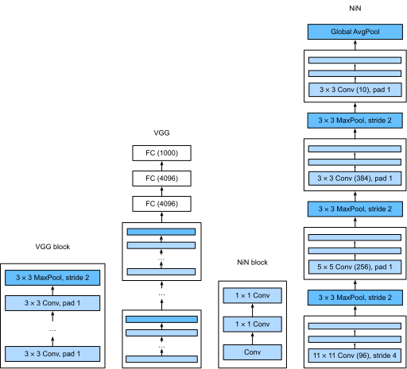

# 网络中的网络（NiN）

前面小节里我们看到LeNet、AlexNet和VGG均由两个部分组成：以卷积层构成的模块充分抽取空间特征，然后以全连接层构成的模块来输出最终分类结果。AlexNet和VGG对LeNet的改进主要在于如何加深加宽这两个模块。这一节我们介绍网络中的网络（NiN）[1]。它提出了另外一个思路，即串联多个由卷积层和“全连接”层构成的小网络来构建一个深层网络。

## NiN块

我们知道卷积层的输入和输出都是四维数组，而全连接层则是二维数组。如果想在全连接层后再接上卷积层，则需要将其输出转回到四维。回忆在[“多输入和输出通道”](channels.md)这一小节里介绍的$1\times 1$卷积，它可以看成将空间维（高和宽）上每个元素当做样本，并作用在通道维上的全连接层。NiN使用$1\times 1$卷积层来替代全连接层使得空间信息能够自然传递到后面的层去。图5.7对比了NiN同AlexNet和VGG等网络的主要区别。



NiN中的一个基础块由一个卷积层外加两个充当全连接层的$1\times 1$卷积层构成。第一个卷积层我们可以设置它的超参数，而第二和第三卷积层则使用固定超参数。

```{.python .input  n=2}
import sys
sys.path.insert(0, '..')

import gluonbook as gb
from mxnet import nd, gluon, init
from mxnet.gluon import loss as gloss, nn

def nin_block(num_channels, kernel_size, strides, padding):
    blk = nn.Sequential()
    blk.add(nn.Conv2D(num_channels, kernel_size,
                      strides, padding, activation='relu'),
            nn.Conv2D(num_channels, kernel_size=1, activation='relu'),
            nn.Conv2D(num_channels, kernel_size=1, activation='relu'))
    return blk
```

## NiN模型

NiN紧跟AlexNet后提出，所以它的卷积层设定跟AlexNet类似。它使用窗口分别为$11\times 11$、$5\times 5$和$3\times 3$的卷积层，输出通道数也与之相同。卷积层后跟步幅为2的$3\times 3$最大池化层。

除了使用NiN块外，NiN还有一个重要的跟AlexNet不同的地方：NiN去掉了最后的三个全连接层，取而代之的是使用输出通道数等于标签类数的卷积层，然后使用一个窗口为输入高宽的平均池化层来将每个通道里的数值平均成一个标量直接用于分类。这个设计好处是可以显著地减小模型参数大小，从而能很好地避免过拟合，但它也可能会造成训练时收敛变慢。

```{.python .input  n=9}
net = nn.Sequential()
net.add(
    nin_block(96, kernel_size=11, strides=4, padding=0),
    nn.MaxPool2D(pool_size=3, strides=2),
    nin_block(256, kernel_size=5, strides=1, padding=2),
    nn.MaxPool2D(pool_size=3, strides=2),
    nin_block(384, kernel_size=3, strides=1, padding=1),
    nn.MaxPool2D(pool_size=3, strides=2), nn.Dropout(0.5),
    # 标签类数是 10。
    nin_block(10, kernel_size=3, strides=1, padding=1),
    # 全局平均池化层将窗口形状自动设置成输出的高和宽。
    nn.GlobalAvgPool2D(),
    # 将四维的输出转成二维的输出，其形状为（批量大小，10）。
    nn.Flatten())
```

我们构建一个数据来查看每一层的输出大小。

```{.python .input}
X = nd.random.uniform(shape=(1, 1, 224, 224))
net.initialize()
for layer in net:
    X = layer(X)
    print(layer.name, 'output shape:\t', X.shape)
```

## 获取数据并训练

NiN的训练与AlexNet和VGG类似，但一般使用更大的学习率。

```{.python .input}
lr = 0.1
num_epochs = 5
batch_size = 128
ctx = gb.try_gpu()
net.initialize(force_reinit=True, ctx=ctx, init=init.Xavier())
trainer = gluon.Trainer(net.collect_params(), 'sgd', {'learning_rate': lr})
loss = gloss.SoftmaxCrossEntropyLoss()
train_iter, test_iter = gb.load_data_fashion_mnist(batch_size=batch_size,
                                                   resize=224)
gb.train_ch5(net, train_iter, test_iter, loss, batch_size, trainer, ctx,
             num_epochs)
```

## 小结

* NiN提供了两个重要的设计思路：(1) 重复使用由卷积层和代替全连接层的$1\times 1$卷积层构成的基础块来构建深层网络；(2) 去除了容易造成过拟合的全连接输出层，而是替换成输出通道数等于标签类数的卷积层和全局平均池化层。

* 虽然因为精度和收敛速度等问题，NiN并没有像本章中介绍的其他网络那么被广泛使用，但NiN的设计思想影响了后面的一系列网络的设计。

## 练习

- 多用几个迭代周期来观察网络收敛速度。
- 为什么NiN块里要有两个$1\times 1$卷积层，去除一个看看？

## 扫码直达[讨论区](https://discuss.gluon.ai/t/topic/1661)


## 参考文献

[1] Lin, M., Chen, Q., & Yan, S. (2013). Network in network. arXiv preprint arXiv:1312.4400.
